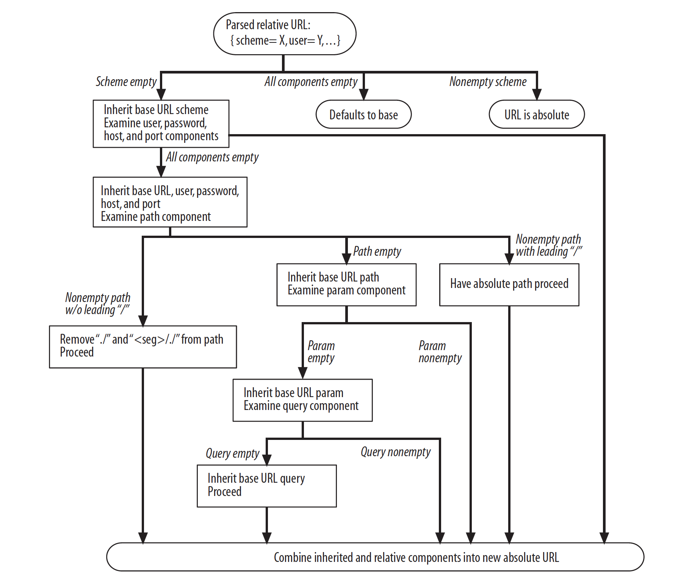

HTTP, Hypertext Transfer Protocol, is designed to become a common language
between web applications. Since first introduce, it has been quickly threaded
and became the most popular protocol in the internet world. In a nutshell, HTTP
is a multimedia courier, which means that it transfer the request from clients
and carries any virtual resource responsed by the provider (servers) on demand.
It is built on top of the TCP/IP, a reliable tranmission protocol. By its
wonderful mechanism, HTTP ensures the reliability and the statefulness of the
data.

## URL and Resources
In HTTP/1.x version, everything is wrapped in a HTTP transaction. Each
transaction includes one request from the client and one response from the
server. Since there are a lot of servers and each server has a lot of resources,
the client must specify which server, and which resource in the server he want
to request via URL (Uniform Resource Locator). This URL can be compared to
physical address in real time. To make clients and servers understand and can
handle, the URLs must follow the following syntax:
```
<scheme>://<user>:<password>@<host>:<port>/<path>;<params>?<query>#<frag>
```
In which:
- `<scheme>`: which protocol the request want to use when communicating with the
  servers. There are plenty of protocol accepted worldwide:
  - `http`: Yup, this is the protocol we are talking about
  - `ftp` (File Transfer Protocol): a legacy but popular protocol used to
    transfer files.
  - `rtsp`: Real time streaming protocol
  There is a huge list of public protocol:
  [https://www.iana.org/assignments/uri-schemes/uri-schemes.xhtml](https://www.iana.org/assignments/uri-schemes/uri-schemes.xhtml). Most of them are experimental or provisional. Besides the public protocol, clients and servers could communicate via a custom protocol that only they know  how to handle.
- `user` and `password`: This part of the URL is mainly used with FTP protocol,
  at the authorization steps. HTTP protocol rarely touches this part.
- `host`: could be a domain name or just a plain IP address. This part is basic
  that I won't talk about it anymore
- `port`: if not provided, the default port number is 80
- `path`: specifies which resources in the server the client want to request.
  Path design is a real art. It can reflect the real file structures of the
  servers, or reflect the whole architect of the system (part of REST methodlogy)
- `params`: nearly outdated and only used in legacy systems. This is an extra
  option for the path. For example:
  `http://google.com/search;type=lucky?query=...`
- `query`: very popular in the world of dynamic web. It allows the clients to
  dynamically request anything on demand. The response will be different based
  on the query. There could be many queries at the same time. Each query is
  separated with `&` character. For example:
  `https://google.com/search?query=hihi&type=haha`
- `frag` (fragment): it is used to identify a part of the page, or the state of
  current page when the page displays multiple parts and the client wants to
  specify a part of them. Usually, the clients keep this fragment without
  sending to the server. They will handle by themself after the response arrive.

That specification is for absolute URL. In real time, people usually use
Relative URL (or sometimes called URL shortcuts), for example:
`./search/advance`, `/cart/show`, etc. The relative URL is resolved and become
absolute URL based on the previous absolute URL or a specific base definition
puts in page header (`<base>` tag).



Since the URLs are used everywhere in the internet world, it must have a high
comptiablibity with all existing systems. That's why the URLs are restricted to
use US-ASCII character set only. Even more, only some reserved characters
besides basic alphabet characters are allowed to keeps its format. Other
characters are escape with this syntax: `%<code>`, in which `<code>` is the
hexadecimal number of the ASCII code of the character want to escape. For
example: `http://google.com/?query=toi%20yeu%20doi%20%7E` is the escaped string of
url `http://goole.com?query=toi yeu doi~`. The list of restricted characters is
listed at [https://tools.ietf.org/html/rfc3986#section-2](https://tools.ietf.org/html/rfc3986#section-2)

## HTTP Messages
In a HTTP transation, everything is packed into a message. The clients send
request message to server, the server respones with response message. The
messages are line-oriented, which means that all information in a message is
structure by lines. When the clients / servers handle the message, it will parse
the message line by line. Every message, both request and response includes three
parts: start line, headers and body. Start line is the first line of the
message. It describes the protocol, version, method ... to inform the opposite
how to handle the message. The headers part contains useful information aside of
the main content in boy. The header information is different between request and
kresponse message. The header part could include many lines. Each line must store
one header information only. The syntax of a header: `<name>: <content>`. To
mark the end of headers, the message use a blank line (CRLF). Even when the
message doesn't have header, the blank line must be included. The last part is
body. It could be anything, from plain text, json, image to a top secret
enscripted string.

To view the raw HTTP message transported, I use `netcat` (`brew install netcat`).
By using the netcat interactive command line, I could see the http messages when
I try to connect to kipalog. That's fun that Kipalog response with 500 error
intead of 405 =)).
```
▶ nc kipalog.com 80
GET / HTTP/1.1
Host: www.kipalog.com
Accept: application/json

HTTP/1.1 500 Internal Server Error
Server: nginx
Date: Tue, 27 Sep 2016 03:19:38 GMT
Content-Type: text/html; charset=utf-8
Content-Length: 0
Connection: close
Status: 500 Internal Server Error
X-Request-Id: 4ffaa15a-3e42-4831-bc1e-aa1d5e5d788d
X-Runtime: 0.010137
```
The lines on the top are the HTTP request response I compose:
```
GET / HTTP/1.1
Host: www.kipalog.com
Accept: application/json
```
It has a high readability since it is designed to be read by both machines and
human. The above message means that I want to get the resource at location `/`
(homepage) with HTTP protocol version 1.1 at host `www.kipalog.com` and I only
accept the response with JSON format. This message is sent to the server of
kipalog.com, then the server response with another message:
```
HTTP/1.1 500 Internal Server Error
Server: nginx
Date: Tue, 27 Sep 2016 03:19:38 GMT
Content-Type: text/html; charset=utf-8
Content-Length: 0
Connection: close
Status: 500 Internal Server Error
X-Request-Id: 4ffaa15a-3e42-4831-bc1e-aa1d5e5d788d
X-Runtime: 0.010137
```
In general, it says that `f*ck`, I have a bug when process the above message.
And provide some information about that. In this case, both request and response
messages don't have a body. Let's try another example
```
▶ nc google.com 80
POST / HTTP/1.1
Host: google.com

HTTP/1.0 411 Length Required
Content-Type: text/html; charset=UTF-8
Content-Length: 1564
Date: Tue, 27 Sep 2016 03:29:40 GMT

<!DOCTYPE html>
<html lang=en>
  <meta charset=utf-8>
  <meta name=viewport content="initial-scale=1, minimum-scale=1, width=device-width">
  <title>Error 411 (Length Required)!!1</title>
  <style>
    *{margin:0;padding:0}html,code{font:15px/22px arial,sans-serif}html{background:#fff;color:#222;padding:15px}body{m
argin:7% auto 0;max-width:390px;min-height:180px;padding:30px 0 15px}* > body{background:url(//www.google.com/images/e
rrors/robot.png) 100% 5px no-repeat;padding-right:205px}p{margin:11px 0 22px;overflow:hidden}ins{color:#777;text-decor
ation:none}a img{border:0}@media screen and (max-width:772px){body{background:none;margin-top:0;max-width:none;padding
-right:0}}#logo{background:url(//www.google.com/images/branding/googlelogo/1x/googlelogo_color_150x54dp.png) no-repeat
;margin-left:-5px}@media only screen and (min-resolution:192dpi){#logo{background:url(//www.google.com/images/branding
/googlelogo/2x/googlelogo_color_150x54dp.png) no-repeat 0% 0%/100% 100%;-moz-border-image:url(//www.google.com/images/
branding/googlelogo/2x/googlelogo_color_150x54dp.png) 0}}@media only screen and (-webkit-min-device-pixel-ratio:2){#lo
go{background:url(//www.google.com/images/branding/googlelogo/2x/googlelogo_color_150x54dp.png) no-repeat;-webkit-back
ground-size:100% 100%}}#logo{display:inline-block;height:54px;width:150px}
  </style>
  <a href=//www.google.com/><span id=logo aria-label=Google></span></a>
  <p><b>411.</b> <ins>That’s an error.</ins>
  <p>POST requests require a <code>Content-length</code> header.  <ins>That’s all we know.</ins>
```

By definition, the overall syntax of the request message:
```
<method> <request-URL> <version>
<headers>

<entity-body>
```
And the response message's syntax:
```
<version> <status> <reason-phrase>
<headers>

<entity-body>
```
### Verion
Version is used to determine which verion of HTTP the request / response need to
be handled in. There are some popular HTTP versions: `1.0`, `1.1` and `2.0`.
Version `2.0` is totally different and I won't talk about it here. Versino `1.0`
and `1.1` is widely used and accepted by nearly all HTTP servers.

### Method
Method is at the start of the request line to specify which action the request
want to execute on the servers. Their are plenty of methods supported widely:
- `GET`: This is the most popular method. When using this method, the requester
  want to fetch (download / view) a single resource on the server. Basically,
  nothing will be changed on the server when the requester send this method.
- `POST`: The default method that the HTML form use to send data to the server.
  It means that the requester want to submit some data so that the server will
  create new resources.
- `PATCH` / `PUT`: Used to update a resource on the server. If the resource does
  not exist, the server will create new one just like the `POST` method.
- `DELETE`: the requester tries to delete something on the server.
- `OPTIONS`: the requester wants to fetch the headers of the response only
  instead of response the full resource. Usually used to check cache validation,
  CORS checking before sent, get the size of lar source ....

HTTP protocol encourage the clients and servers follow the above meanings the
methods. However, it is likely that the clients and servers use a totally
irrelative methods to their demands.

### Status code
The status code is a number that summaries the response result. Their are a lof
of status code that we need to remember. They are categoried to 5 groups:
- `1xx` status: information. This status category is usually for information
  announcement. Widely used in HTTP client implementation. The normal web pages
  don't require to use these status codes.
- `2xx` status: used to announce that the request is successfully processed.
  Some popular code is `200`, `201`, etc.
- `3xx` status: redirection status category. Used to announce the clients that
  there are some resource reallocations occur on the server and the client
  should fetch the needed resource at another URL
- `4xx` status: client fault. Used to announce the clients that they sent
  something wrong to the server. Or the request doesn't have enough required
  information. Or the request doesn't have a right access.
- `5xx` status: Server fault. Used to describe some errors happened when process
  the request.

### Reason phrase
When above status code is not enough to describe the response state, reason
phrase is used to add up readable information about the response like `OK`,
`Restricted' ...

### Headers
Headers are the most important elements of HTTP protocol. It helps in the
resource identification like resource length, caching control, etc. You can even
add your own HTTP headers without worry much about it. The headers could be
splited into 5 types: `General headers`, `Request headers`, `Response headers`,
`Entity headers` and `Extension headers`.

## Connection management
As mentioned far far above, the HTTP protocol is built on top of the TCP/IP. So,
it depends crictically on TCP transportation protocol. Since HTTP specification
is so simple, the time spent on processing HTTP layer only is just a small part
of the whole processing time. Most of the time is spent on data connecting and
transportation time, which belongs to TCP layer. So, we should have a look at
what the TCP is and how it takes the main reponsibility in data transportation.

- TCP is a reliable transportation protocol. After established, TCP will make
  sure that all the data it takes responsibility to transfer is completed. The
  word "completed" here means that it won't be damaged, lost, or modified
  silently without the awareness of the owner. It follows the rule "All or
  nothing". If a transported data is not completed due to any reason, it will be
  destroyed and TCP will send another data to replace.

- TCP depends on IP network protocol to send the data. It will split its data
  into smaller parts called chunks, and packed each chunk into one IP packet,
  then sent via the IP protocol. The TCP protocol doesn't take care of the real
  transportation process itself. It only takes care of the sending distribution,
  data integrity, fault handling, etc. We can imagine that IP protocol is the
  truck that carries the rocks on the street. It can deliver to the right
  address. Sometimes, it makes some rocks smashed, drop some rocks while moving,
  or being forced to stop at the transportation control gateway and could not
  continue its trip. TCP could be considered as the transportation provider. It
  received rocks from the clients (HTTP), then it manages to split the rocks
  into small parts that fit the truck size, guide the trucks to go to the right
  address. If something wrong happens, it will decide whether send antoher truck
  to fix the problem or cancel the whole contract and sorry the client (HTTP
  gonna cries).

- Each IP packet has a header that contains the information of its mission. 20
  bytes is for IP information itself, 20 bytes is for HTTP information.

- At the start of the TCP transporation, TCP establishes the connection to the
  destination location. This establishment is called TCP connection handshake.
  This could be considered as a gentle request "Hey, could I send some data to
  you"? If the destination agrees with the request, it will prepare something to
  be ready to receive the data and response "Okie dude, you could send now". In
  the real time, TCP will first send a special packet with `SYN` flag the
  destination. If the server is okay with the request, it sends a package with
  `SYN + ACK` flag back to the sender. If the sender doesn't change it mind, it
  will start to send the first data packet with a `ACK` flag to the
  destiniation. Then, all the packets will be send sequentially. Finally, the
  connection is closed and finish the transportation.

- Each TCP connection is identified uniquely by four factors: `destination IP`,
  `destination port`, `source IP`, `source port`. If an IP packet has the same 4
  factors, it is considered to belong to the same TCP connection. That causes a
  serious problem. In case connection A finished, then connection B is established
  with the same 4 factors. If a packet of connection A arrives too late (due to connection
  problem) after the B is established, it could be classified to belong to
  connection B and makes the whole connection B wrong. To avoid this problem,
  people use Delayed Acknowledgement Algorithm. It states that the destination
  gonna wait about 100 - 200ms to make sure that all packets of A arrived, or
  destoryed in the way. However, this algorithm decreases the performance of the
  whole TCP protocol. So, in this modern day, because it is unlikely that the late
  arrival gonna happen, people usually set `TIME_WAIT` to the most minimal value
  as possible to prevent above case.

- When loading a page, it is likely that there are hundreds connections need to
  be request. Many of them are in the same servers. The traditional algorithm
  that loads all the requests sequentially soon becomes super slow and need to
  be replaced. So, on the modern day, the HTTP clients are implemented to send
  multiple requests at once. The number of parallel connections is depend on the
  HTTP clients, usually 8 - 16. That increases the performance, but still not
  fast enough. People realize that a lot of time is spent for connection
  establishment. They come up with the idea: how above using the same connection
  for multiple requests. And they implement that idea with `Connection:
  keep-alive` heaaders in `HTTP/1.0`. That works perfectly and decrease a lot of
  processing time. So, in `HTTP/1.1`, which is the most popular HTTP version
  right now, the default HTTP behaviour is to keep the connection alive except
  the requester wants to close it right away. The servers gonna wait about 15s
  from the last package received. After 15s and no packages sent, it will close
  the connection. This mechanism is called persitent connection. Combining with
  the above parallel connection management, right now, ech client establish
  multiple connections at once and each connection is persistent and could be
  used to send multiple requests. That decreases the loading time dramatically.

## Web servers
The interet world expands so big like today thanks to the apperance of web
servers. There are countless web servers available on the world, from the old
giant like Apache, Nginx to tiny web servers with some lines of codes. In
general, all the web servers have the same mechanism: receive HTTP request,
process it and sending back the response. The mechanism is simple, but how to
implement it insdie is not simple. A good implemented web server is optimised at
every step to serve thousand or million requests per hour. To determine how they
could do that, let's look at how a request is handle when being sent to a web
server.
- 1. Accept client connections: this is actually the conneciton establishment
     step, when a request is sent to the server, it must decide accept / decline
     the request. Usually, this step is handled by the OS or low level system
     that the web servers don't need to care much about except it wants to
     optimize.

- 2. Receving request: this step is important. This step decide how many
     concurrencis the server could handle. The wolrd concurrency here means
     the number of requests the server could receive and wait to server. It
     doesn't mean the number of requests the server processed at once. Imagine
     the server is like a restaurant, a request is like a customer. Whey they
     order, the restaurant add their order to a queue to serve. At the time,
     there could be hundreds of waiting guesses, while the restaurant could only
     process some of the orders at once. The rest of them have to wait until
     their turn. In fact, all the requests are queued into a connection list and
     be served by the request time order.

- 3. Request processing: from the connection list, the web server will decide
     how to process the each request. If the request is to access a static
     resource and the web server is built with that funciionality, it will
     handle the resource accessing. In the most of the cases, the web servers
     delegate request processing to request handler which is written in
     different programming languages like PHP, Ruby, etc. The web server now
     just takes part in the request distribution. Usually, the request handler
     spawns multiple processes. The web server gonna a request is sent into
     which processes. The request handlers could be placed in external servers.

- 4. Sending response: the web servers takes the response from the request
     handlers, then packs it up and send back to the requester

- 5. Logging: Usually, after processed, the web servers gonna log everything
     into log files.

The above mechanism is just the most simple web servers. In real time, to
archive a big amount of requests hanlded per second, the web server system is
transformed into much more complicated form. I won't discuss it here (actually I
don't know :smile:)

## Caching
In the internet world, data transportaion is a costly process, especially when
the destination server is far far way from the source and the data size is huge.
People when browsing the internet usally need to request the same URL times over
times. It could be a logo of a website, a javascript files used everywhere in
the page or even the whole about page. These resources don't change as regular
as the user request frequency. That's why people come up with the idea to cache
the unusually changed resources. It means that the resource is stored at the
local storage, when the people request that resource again, the local version is
used instead of requesting the resource from the remote destination. People
implemented multiple levels of caching to increase the speed, from the client
caching level (implemented in browsers) to caching proxy or even the CDN idea.
All the cahcing mechanism must taken care of the freshness of the resource.
Because it is meanless to use an outdated resource time over time. So, the
cahcing engines have a good way to maintain the freshness of the resource.

- The resource from the response should have an information to know how long the
  resource keeps its freshness. It means that in that time, the cahcing engines
  could response the document right away. Otherwise, it needs to request to the
  server to fetch information. That value is set in the HTTP header:

  - `Expires: Fri 04 Oct 2016, 05:00:00 GMT`: this is the convention of
    `HTTP/1.0+`, it says that this recoure **could** be updated after this time.
    This time has a flaw that if the client doesn't set the time right, the
    expire period will be calculated late and cause outdated problem.

  - `Cache-control: max-age=3600` or `Cache-control: s-maxage=3600`: it is the
    convention of `HTTP/1.1`. The value here is `3600` here exposes that it will
    exprire 3600s (1 hour) after the request time. The request time is set with
    `Date` header in the response. By this convention, the clients don't need to
    have a right time. It just needs to calculate based on the request `Date`
    and the `maxage` value.

- When the user request an expiered resource, the clients will request to the
  server again. If the resource is still fresh, the server will response with
  `304` header and blank body. The caching engines receive the response and
  update `maxage`, `expires` and the `Date` of the stored request again.
  Otherwised, the response contains full resource data. The caching engines will
  delete the local stored document, put new resource and update the `expires`,
  `maxage` and `Date` value again.

- In some system, there exists cache servers and cache proxy. These are just the
  middle servers standing between the clients and the destination. When a
  request is sent, it hits the cahcing servers / proxies first, they will check
  the freshness just like the above mechanism. If the cache doesn't exist, it is
  sent to the next level caching server if exist. There could be level 2 or even level
  3 cahce servers. The first levels store popular documents, the second stores
  less popular ones and so on. In the mean time, the caching servers send
  revalidaion request frequently to the destination to make ensure the freshness ratio in
  the servers.

- To measure the cahcing performance, people calculate `Cache hit ratio` and
  `Cache byte hit ratio`. The `cache hit` ratio is the percent of cahce exists
  over the total request. The perfect score is 1.0, means that 100% of the
  requests are cached. In real time, the acceptable score is 0.4. If the
  resource size diverses and the cache hit ratio doesn't reflect the right
  value, people use `cahce byte hit ratio`. It will calculate based on the size
  of the resource instead of the count.


