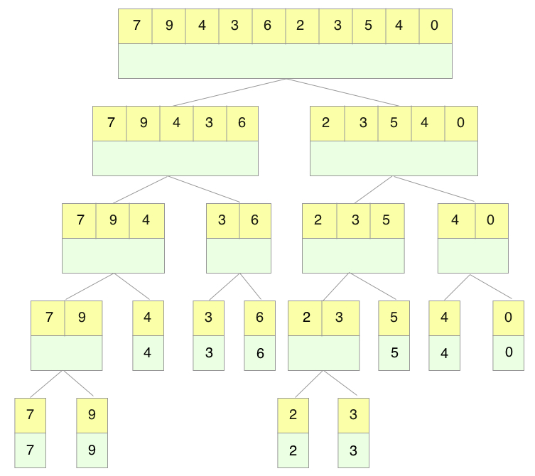

# Introduction to Interval Tree

In this post, I'll show you some introduction to an advanged data structure called Interval Tree. Note that the word `advanged` here means that this data structure is used to solve a too specific kind of computer science problems. It doesn't do anything with the level of the developers. Don't worry, you don't need to be a ninja to read. I bet you will be surprised about how simple it is :)

I don't intend to write a science document. This post is just a post I wrote for myself to read later. I'm trying to explain the concept of Interval tree as simple as I could, based on what I researched about it. So, you could find tons of bugs inside. Please report / discuss with me to make it better.

### Let's get started
Before we jump suddenly into the definition. Let's just start with this simple problem that all developers solved at the beginning their entire carrers: find the maxximum element of an array. For example and result:
```
A = [7, 9, 4, 3, 6, 2, 3, 5]
Max(A) = 9
```
It is too easy for you huh? Just a single loop and done. Problem solved. The time complexity of this problem is `O(n)`.

Continue with something more complicated: find the maximum element of all elements with index from `i` to `j` of a given array. For example and result:
```
A = [7, 9, 4, 3, 6, 2, 3, 5]
Max(A, 3, 5) = Max([3, 6, 2]) = 6
```
Hm... Nothing changes. It's just a little more abstract problem of the above one. The complexity is still `O(n)`.

Are you now disappointed? Let's the fun begin: given an array `A` with `n` elements and `m` pairs of number; with each pair of number `i` and `j`, print out the maximum element of all elements with index from `i` to `j` of `A`. Note that `n <= 100` and `m <= 1_000_000`. For example and result:

```
A = [7, 9, 4, 3, 6, 2, 3, 5]
n = 8
m = 3
Max(A, 3, 5) = Max([3, 6, 2]) = 6
Max(A, 1, 2) = Max([9, 4]) = 9
Max(A, 0, 7) = Max(A) = 9
```
This one is totally, different right? You may come up with many solutions for this. You can think about building a cache 2D array at the beginning to store all the maximum values. That's a good solution. With some dynamic programming technique, it becomes `O(n^2)`. But it doesn't work if we increase the number of `n` to about `100_000`. Before you found a good solution for this. Let's make it more difficult :D

### Ultimate problem
Given an array `A` with `n` elements and `m` set of number (`n <= 100_000`, `m <= 1_000_000`). Each set of number has two format:
* `0 i j`: print out the maximum elements with index from `i` to `j`
* `1 i j k`: set all elements with index from `i` to `j` to the value `k`

For example:
```
A = [7, 9, 4, 3, 6, 2, 3, 5, 4, 0]
n = 10
m = 7
Max(A, 3, 5) = 6

Update(A, 3, 4, 10)
=> A = [7, 9, 4, 10, 10, 2, 3, 5, 4, 0]

Max(A, 1, 4) = 10
Max(A, 3, 9) = 10

Update(A, 2, 6, 1)
=> A = [7, 9, 1, 1, 1, 1, 1, 5, 4, 0]

Max(A, 1, 4) = 9
Max(A, 3, 9) = 5
```
If you want to try the tradition solution that just loop and update the value and then loop and count, forget about it. With the time complexity `O(n*m)`, it will cost you `100_000 * 1_000_000 = 10^11` operations. On my Macbook Pro 2015, Core i7, it costs me hours to finish. This solution is unacceptable.

How about caching into 2D array like above? Nah, think about `100_000 x 100_000 x 4` bytes for that giant array. Even the array building at beginning is costly too. In addtion, when you update the elements, the whole 2D array must be updated too. That destroys the whole caching idea of this solution.

Wow, this is tough hah? To archive the problem requirement, we loop too much, for both query and updating. You must wish that we don't need to loop that much. If you look again at the above example, you will see that range `0..1` which is `[7, 9]` and range `7..9` which is `[5, 4, 0]` don't change at all. So, the query result doesn't change if we process the query on those range. We could cache that. Unfortunately, there is not any operation that match exactly with the range we need to query. Let's find some way to walk around it.

The problem requirement is too find the maximum elments. Recall the some arithmetical nature of maxinum operation. `Max(a, b) = a if a > b` and `Max(a, b) = Max(b, a)`. Hmm... Nothing interesting. We are working on range. How about the maxinum operation on three element? `Max(a, b, c) =  Max(a, Max(b, c))`. For element? `Max(a, b, c, d) =  Max(Max(a, b), Max(c, d))`. Oh hey! We could find the max of a range by spliting the range into two ranges, find the max of each range and compare those partial maxes to get the whole range's max. Let's apply for the above example.
```
Max(A, 3, 9) = Max(Max(A, 3, 6), Max(A, 7, 9))
```
The range `7..9` doesn't change from the beginning to the end. We should cache that part and find just loop to find the maximum from `3..6`. That seems legit!  Split the entire array into two ranges, each range is splitted into smaller ranges and so on. Oh wait. Isn't that the concept of **binary tree**? Yup. We can solve the problem by setting up a special type of binary tree. Each node will manage a range `i..j`. In this context, it is reasonal to choose let two child ranges equal. So, left node manages `i..(i + j) / 2` and right node manages `(i + j) / 2 + 1 .. j`. This new kind of tree is called **Interval Tree** (usually ambiguous with its coursin **Segment Tree**, I'll discuss about this later). Obviously, the way array is splited into half leads to the fact that Interval Tree is a **balanced binary tree**. Each node has no children (leaf node) or two children (normal node).

### A little more abstraction
In fact, when working with pure computer science problems, people realize there are many ones which could be categorized into the same class of this problem. For example: instead of finding min or max, we need to find the sum of a range in an array; or we need to find out how many elements in a range which are bigger than a number, etc.
Step back a little while and think of the similarities of mentioned problems, we can easily conduct some abstract natures for the union set of problem:
* Initially given some array A with pre-defined values for each element
* We could process two types of operation on the given array: query and update operations.
* The update operation usually require us to update all elements in range i..j of the array A, usually set value, increase, decrease etc.
* The query operation usually require us to find the final processing result (usually count, sum, multiply ...) from all the elements satisfying condition K (optinal) in a range i..j of the array A.

Interval tree was born to solve this kind of problems efficiently. Although each problem could have better exclusive optimised solution, the Interval Tree is more abstract, reuseable and doesn't require further research time. Subsequently, if you don't need a specially strict solution for those problems, I think interval tree is great enough for most of the cases.

### Problem solved

#### Building the tree
It's time to go back to our problem. From the array `A = [7, 9, 4, 3, 6, 2, 3, 5, 4, 0]`, we build the Interval Tree in which the root node is the whole array. Left node is the segment `[7, 9, 4, 3, 6]` and the right node is `[2, 3, 5, 4, 0]`. Apply the same rule for those nodes until we reach leaf node, which contains only one element. Beside the managed range, each node contains one more attribute called `Range Max`, which is the maximum element of the managed range. Initally, only the leaf node has range max value which is the only value of the managed range. Recursively building the tree from the root node to the leaf node, we got this tree:


*Upper yellow part is the range that node manage and bottom green part is the range max*

Obviously, we find the range max of non-leaf node easily by its two children: `node.range_max = Max(node.left.range_max, node.right.max_max)`. The tree building process could be subscribed by the following ruby code:
```ruby
def build(range)
  node = Node.new(range: range)
  if range.count == 1
    node.range_max = A[range.first]
    return node
  end
  mid = (range.count - 1) / 2
  node.left = build(0..mid)
  node.right = build((mid + 1)..(range.count - 1))
  node.range_max = [node.left.range_max, node.right.range_max].max
  return node
end
```
Each node of an Interval Tree must have 0 children node (leaf node) or 2 children node (normal node). Subsequently, we don't have to be worried about out of range case of the building process. Using above algorithm, we got the whole tree:


#### Query operation
To solve the query operation, for example: `Max(A, 3, 5)`, we follow the basic idea: starting with the root, if the node range match 100% with the query range, return the range max as the querying result, otherwise, continue to browse left and right node and return maximum values between left and right querying result. Go back to our current example, we illustrate it by the following figure. The red line is the query result we want to find. It starts at the beginning of the query range and ends at corresponding one.


At the root node, we only have the information of the range max from index 0 to 9. The query result `Q` we want to query is index 3 to 5. We could not conduct a right result from this information. Applying above idea, we need to find the query result `Q1` upon the left node and `Q2` upon the right node. Then, `Q = Max(Q1, Q2)`. Since the left node manage the range from 0 to 4, we only need to find `Q1` from 3 to 4. Similarly, we only need to find `Q2` from range index 5 to 5 upon the right node.


After spliting, we approach the result, but we are still not there yet. Continue spliting the range of `Q1` into `Q3` and `Q4`, and the range of `Q2` into `Q5` and `Q6`. The final result will be `Q = Max( Max(Q3, Q4), Max(Q5, Q6) )`.


Oh wait a minute! Some thing is wrong with `Q3`. The node contains `Q3` manages the range from index 0 to 3, while `Q1` is the result from ... index `3` to index `2`. Hm... I got it. The `Q1` is 100% belongs to the left child node of the node it belongs. So, we don't need to browse the right child node. The sam fact happens with `Q6`. Subsequently, `Q3` and `Q6` is redundant. Let's rename and change the fomula a little bit: `Q = Max( Max(Q3), Max(Q4) ) = Max(Q3, Q4)`


Finally, we got a 100% match. The `Q3` match 100% with its node. So, `Q3` is equal to the range max of its node. In this case, `Q3 = 6`, and `Q1 = Q3 = 6` too. We stop browsing `Q3`'s children nodes from now. In the oposite, `Q4` is still a mysterious, keep spliting deeper until we reach the 100% match, we got the full query tree. Obviously, `Q6 = 2`, `Q5 = 2`, `Q4 = 2` and `Q2 = 2`. Subsequently, `Q = Max(Q1, Q2) = Max(6, 2) = 6`. The full query operator is describe below:


You must be thinking that what the hell, the traditional loop cost only 3 steps. While this algorithm cost nearly at least 7 steps. Yeah, you are right. In micro queries, interval tree is slow comparing to traditional way. Usually, people overcome this weakness by applying traditional searching for micro queries (such as queries with the range under 10 for example) and apply interval-tree-way query for larger queries. If you try another example: `Max(0, 7)`, the interval tree is remarkable faster than traditional way:


Yup, 4 steps vs 8 steps. Interval Tree wins! The bigger the data is, the more the Interval Tree saves you. After the example, we can easily implement the query operation with following persuade code. To make our code simpler, instead of checking redundant browsing path, we check the out of range condition and return negative infinity if vilolated. It won't affect the result of `Max` operation.

```ruby
def query(current_node, query_range)
  if query_range.last < current_node.range.first || query_range.first >
  current_node.last
    return -INFINITY
  end
  if query_range == current_node.range
    return current_node.range_maxx
  end
  max_left = query(
    current_node.left,
    query_range.first..current_node.left.range.last
  )
  max_right = query(
    current_node.right,
    current_node.right.range.first..query_range.last
  )
  return [max_left, max_right].max
end
```

* Raise the problem with updating operations: it still update all the elements
  => decrease the time complexity to `O(n*m)`. Quote the example above. Improve the solution by caching
  updating operation: updating go from top to bottom. If the updating range
  match 100% of the current range, no need to go deeper, mark that node
  updating. When query from top to bottom, if 100% match again, return that
  value, no need to gather deeper children. If need its deeper query, update
  that cached node and its children.
* If possible, post some gifs here to illustrate the whole solution
* Benchmark and compare two algorithm

### Another problems (draft)
* From abstraction part, raise problems with counting (LITES on SPOJ) and describe the solution
* Real life example with calculate reactangle area problem (available on SPOJ)

### 2D Interval Tree (draft)
* Devide and conquer classic problem => Lead to 2D Interval Tree which has 4
  children and manage a 2D Reactangle instead of a range.

### Interval Tree vs Segment Tree (draft)
* Segment Tree is the basic version of Interval Tree. Mainly used to count
  things.

